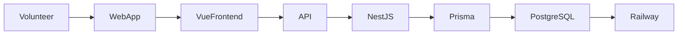

# Friend Helper


Friend Helper is a lightweight outreach coordination application designed to help volunteer teams support individuals experiencing homelessness.

The system helps teams:

- track people they encounter during outreach
- record requests for needed items
- prepare supplies in the warehouse
- document deliveries during outreach routes

The goal is to provide a **simple, fast, and reliable tool for field volunteers** while building a useful historical record of outreach encounters.

---

# Table of Contents

- [Project Status](#project-status)
- [Architecture Overview](#architecture-overview)
- [Core Concepts](#core-concepts)
- [Key Features](#key-features)
- [Design Principles](#design-principles)
- [Technology Stack](#technology-stack)
- [Documentation](#documentation)
- [Future Directions](#future-directions)

---

# Project Status

**MVP v0.1**

The application is currently in **real-world field testing** with outreach teams.

The MVP intentionally focuses on the **core operational workflows** required by outreach organizations.

Future development will be guided by feedback from real-world use.

---

# Architecture Overview



---

# Core Concepts

The system is built around four primary entities.

## Person

Represents an individual encountered during outreach.

A person may have:

- a name or nickname
- aliases
- notes
- a current known location

Each person accumulates a **timeline of encounters** over time.

---

## Request

A request records items needed by a person.

Examples include:

- socks
- water
- blankets
- jackets

Key properties:

- Requests belong to a **Person**
- A request may contain **multiple items**
- Requests have a status such as **OPEN** or **DELIVERED**

---

## Encounter

An **Encounter** records an interaction with a person.

Examples include:

- creating a request
- delivering requested items
- welfare checks
- general interactions

Encounters create a historical timeline.

Example:

```
Jan 10  Request socks
Jan 17  Delivered socks
Jan 24  Welfare check
```

---

## Route

Routes represent the paths outreach teams follow during outreach sessions.

Routes are used to:

- organize volunteer teams
- group known outreach locations
- filter warehouse requests

Routes are a **logistical structure**, not the owner of requests.

---

# Key Features

## Outreach Route Screen

Volunteers can quickly view people on a route and deliver requested items.

Each person card displays:

- requested items
- delivery action
- **Last Seen** indicator based on the most recent encounter

Example:

```
John
Last seen: 3 days ago – Library steps

Needs: socks, water
[ Deliver ]
```

Deliveries require **two taps** to confirm to prevent accidental recording.

---

## Encounter Tracking

Every delivery automatically creates an **Encounter record**.

This builds a timeline of outreach activity and allows teams to see:

- when someone was last encountered
- where they were last seen
- previous outreach interactions

---

## Warehouse Preparation

Warehouse volunteers prepare supplies using the **Packing Summary**.

The system aggregates requested items across all open requests.

Example:

```
Packing Summary

Socks        14
Water         9
Blankets      4
```

Requests can also be filtered by **Route**.

---

# Design Principles

## Simplicity

The application is designed for volunteers who may have minimal technical training.

Hidden gestures such as **long-press interactions have been intentionally removed**.

---

## Fast Field Interaction

Typical field interactions should take **less than five seconds**.

```
Open person
Deliver item
Done
```

---

## Historical Tracking

Encounters create a timeline of interactions with people over time.

This helps outreach teams understand:

- where someone was last seen
- what items were requested
- patterns of contact

---

## Flexible Data Model

The Encounter model supports future features such as:

- encounter notes
- welfare checks
- referrals
- location tracking
- analytics

---

# Technology Stack

Frontend  
Vue 3

Backend  
NestJS (Node.js)

ORM  
Prisma

Database  
PostgreSQL

Hosting  
Railway

Authentication  
Google Login

---

# Documentation

Additional documentation is available in the **GitHub Wiki**.

Topics include:

- Core Concepts
- Workflows
- Data Model
- Architecture
- Deployment
- Field Testing

---

# Future Directions

Future improvements may include:

- encounter notes
- route progress tracking
- warehouse inventory tracking
- analytics and reporting
- improved location tracking
- offline support for field teams

Development priorities will be guided by feedback from outreach teams using the system.

---

# License

TBD